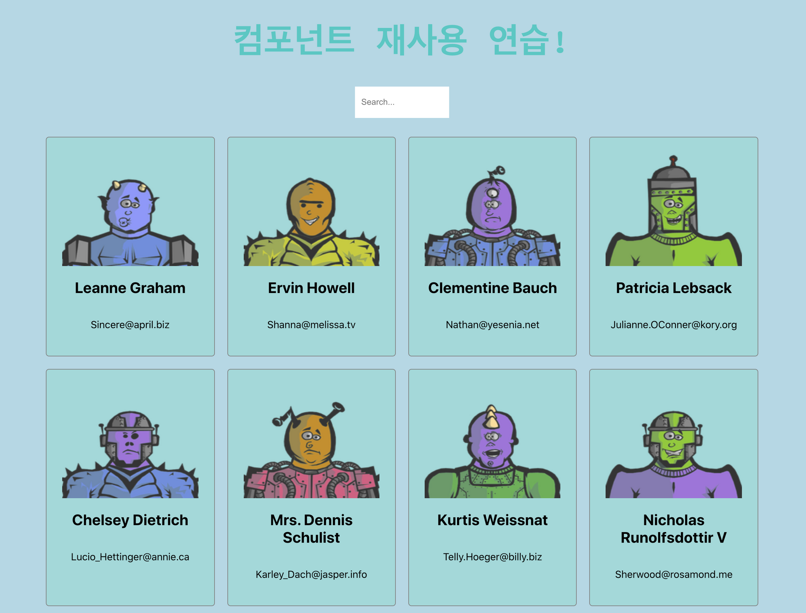

# monster-react-justcode

> API 호출, Hook 활용

## 🚀 Mission 1

**API 호출**

<details>
<summary>과제 설명</summary>
<div markdown="1">
<br>

- **파일:** `Monsters.js`
- 아래 키워드들을 활용해 데이터를 호출 한 후, state에 저장
  1. `useEffect()`
  2. `fetch()` → **호출할 API 주소:** [https://jsonplaceholder.typicode.com/users](https://jsonplaceholder.typicode.com/users)
  3. `useState()` → useState 훅을 이용해 state에 데이터를 저장

</div>
</details>

## 🚀 Mission 2

**API 호출의 결과값 props로 자식에게 전달**

<details>
<summary>과제 설명</summary>
<div markdown="1">
<br>

- **파일:** `Monsters.js`
- 데이터를 저장한 state를 자식 컴포넌트인 `<CardList />` 에 전달 (props 활용)
- 넘겨준 후 `CardList.js` 에서 props 를 콘솔에 찍어 확인

</div>
</details>

## 🚀 Mission 3

**Array.map() 사용**

<details>
<summary>과제 설명</summary>
<div markdown="1">
<br>
- **파일:** `CardList.js`
- 🚨  `Array.map()` 함수 사용법을 꼭 익히고 시작해주세요!
- 넘겨 받은 데이터를 기준으로 `Array.map()` 함수를 활용하여 `<Card />` 컴포넌트를 리턴해주세요.
- `Card.js` 에게 넘겨줘야하는 props 는 각 몬스터 객체의 `id`, `name`, `email` 입니다.

</div>
</details>

## 🚀 Mission 4

**props 활용**

<details>
<summary>과제 설명</summary>
<div markdown="1">
<br>

- **파일:** `Card.js`
- Card.js 컴포넌트 모양 및 구조
  
  ```javascript
  <div className="card-container">
  	
  	<h2>Name</h2>
  	<p>Email</p>
  </div>
  ```
- **이미지 주소 (**`src`**)**
  `https://robohash.org/숫자?set=set2&size=180x180`
  카드마다 다른 이미지를 보여주기 위해 위 주소의 `숫자` 부분을 props 로 내려받은 `id` 로 대체
  ```
  💡 예시)
  https://robohash.org/1?set=set2&size=180x180
  https://robohash.org/2?set=set2&size=180x180
  https://robohash.org/3?set=set2&size=180x180
  ```

</div>
</details>

---

## 참고

- 최종 결과 화면
  
